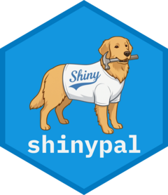

# shinypal <a href="http://williamgearty.com/shinypal/"></a>

<!-- badges: start -->
[](https://lifecycle.r-lib.org/articles/stages.html#experimental)
[](https://github.com/willgearty/shinypal/actions/workflows/R-CMD-check.yaml)
<!-- badges: end -->

**shinypal** provides the building blocks for modular, interactive
[Shiny](https://shiny.posit.co/) applications that turn point-and-click
pipelines into reproducible R and R Markdown code. Using `{shinymeta}`,
shinypal assembles code modules into a draggable workflow, shows the
equivalent code as the user builds it, and lets them export the whole
pipeline as a runnable script or rendered report.

## Installation

shinypal is not yet on CRAN. Install the development version from GitHub:

``` r
# install.packages("pak")
pak::pak("willgearty/shinypal")
```

## How it works

A shinypal app has two halves:

- A small **host app** that calls `shinypal_ui()` in its UI and
  `shinypal_setup()` at the top of its server function, pointing both at a
  directory of modules.
- One **module** per group of analysis steps. A module is a folder with at least three
  files: `ui-main.R` (the panel advertising the steps), `ui-aux.R` (the interactive
  workflow components related to those steps), and `server.R` (which builds the steps'
  `{shinymeta}` reactives and registers them via shinypal).

As steps are added, shinypal keeps a reactive *code chain* in workflow order,
renders each step's generated code, and assembles a downloadable script or
report. See `vignette("shinypal")` for a walkthrough of building your own app.

## Funding and acknowledgements

Development of shinypal has been supported by:

- A Norman Newell Early Career Grant from the [Paleontological Society](https://www.paleosoc.org/).
- Grants (#[G2023-20946](https://sloan.org/grant-detail/g-2023-20946), #[G-2025-79206](https://sloan.org/grant-detail/g-2025-79206)) from the Alfred P. Sloan Foundation through the
  [Syracuse University Open Source Program Office](https://opensource.syracuse.edu/)
  (SU-OSPO).

## License

GPL (>= 3) © William Gearty
